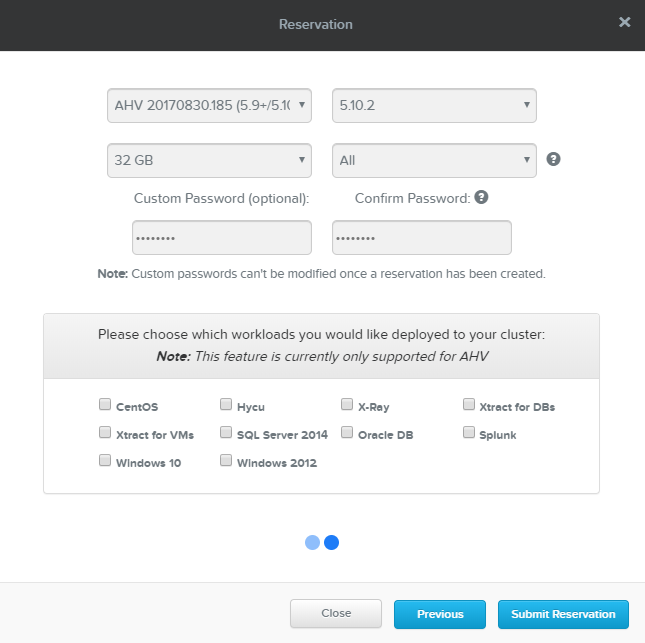

.. role:: html(raw)
   :format: html

.. _clusterinfo:

---------------
Cluster Details
---------------

.. _clusterassignments:

Cluster Assignments
+++++++++++++++++++

*As GTS2019 has ended, you will need to reserve your own HPOC cluster to perform labs.*

When reserving a cluster in RX, ensure you use the AHV and AOS versions shown below.

Refer to the `Nutanix Workshops HOWTO <http://ntnx.tips/HOWto>`_ for complete instructions on how to automate staging the cluster after RX completes the Foundation process.

:html:`<strong>The cluster must be staged according to these instructions before labs can be performed.</strong>`

.. _stagingdetails:

Cluster Staging Details
+++++++++++++++++++++++

Each attendee will require an AOS 5.10.2 (AHV 20170830.185) cluster, staged as follows (using the staging automation linked above):

.. note::

  Refer to your **Reservation Confirmation** e-mail from automation@nutanix.com (generating by RX) for the *XX* and *YY* octets for your cluster and replace where appropriate.

  For example, if your **Cluster/Prism Element Virtual IP** is 10.42.10.37, substitute *42* for *XX* and *10* for *YY* below.

Virtual Machines
................

The following VMs have already been provisioned to each cluster:

.. list-table::
   :widths: 25 25 50
   :header-rows: 1

   * - VM Name
     - IP Address
     - Description
   * - **Prism Central**
     - 10.XX.YY.39
     - Nutanix Prism Central 5.10.1, Calm 2.6.0.3
   * - **AutoDC2**
     - 10.XX.YY.40
     - ntnxlab.local Domain Controller

Images
......

All disk images required to complete the labs have been uploaded to the Image Service for each cluster:

.. list-table::
   :widths: 50 50
   :header-rows: 1

   * - Image Name
     - Description
   * - **Windows2012R2.qcow2**
     - Pre-built Windows Server 2012 R2 Standard Disk Image (Sysprep)
   * - **Windows10-1709.qcow2**
     - Pre-built Windows 10 Disk Image (Sysprep)
   * - **CentOS7.qcow2**
     - Pre-built CentOS 7 Disk Image
   * - **ToolsVM.qcow2**
     - Pre-built Windows Server 2012 R2 + Tools (pgAdmin, CyberDuck, text editors, etc.) Disk Image
   * - **acs-centos7.qcow2**
     - CentOS Kubernetes Host for Karbon Disk Image
   * - **ERA-Server-build-1.0.1.qcow2**
     - Era 1.0.1 Disk Image
   * - **move-3.0.1.qcow2**
     - Move 3.0.1 Disk Image
   * - **hycu-3.5.0-6253.qcow2**
     - HYCU 3.5.0 Appliance Disk Image
   * - **sherlock-k8s-base-image_403.qcow2**
     - Xi IoT EdgeOS Disk Image
   * - **VeeamAvailability_1.0.457.vmdk**
     - Veeam Backup Proxy for AHV 1.0 Disk Image
   * - **VeeamBR-9.5.4.2615.Update4.iso**
     - Veeam Backup & Replication 9.5 Update 4 ISO Image

Credentials
...........

The lab guides will explicitly share any unique credentials, the table below contains common credentials used throughout the labs:

.. list-table::
  :widths: 33 33 33
  :header-rows: 1

  * - Name
    - Username
    - Password
  * - **Prism Element**
    - admin
    - *Based on your HPOC Reservation*
  * - **Prism Central**
    - admin
    - *Based on your HPOC Reservation*
  * - **Controller VMs**
    - nutanix
    - *Based on your HPOC Reservation*
  * - **Prism Central VM**
    - admin
    - *Based on your HPOC Reservation*
  * - **NTNXLAB Domain**
    - NTNXLAB\\Administrator
    - nutanix/4u

Networks
........

The following virtual networks have been pre-configured for each cluster:

.. list-table::
   :widths: 33 33 33
   :header-rows: 1

   * -
     - **Primary** Network
     - **Secondary** Network
   * - **IPAM**
     - Enabled
     - Enabled
   * - **DHCP Pool**
     - 10.XX.YY.50 - 124
     - 10.XX.YY.132 - 229
   * - **Default Gateway**
     - 10.XX.YY.1
     - 10.XX.YY.129
   * - **Netmask**
     - 255.255.255.128
     - 255.255.255.128
   * - **DNS**
     - 10.XX.YY.40 (DC VM)
     - 10.XX.YY.40 (DC VM)
